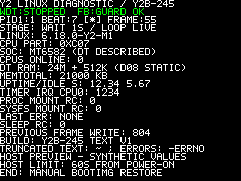

# Y2B-245 — Offline on-screen diagnostic candidate

2026-09-08. **Built and validated offline; NOT flashed and no new hardware launch authorized.**
Issue [#20](https://github.com/SchulzCode/Y2Linux/issues/20); [D14 design](../knowledge/on-screen-diagnostics.md).

## First hardware result and M1

The owner explicitly reports **solid green** from Y2B-240. Under the implemented
state machine this is evidence that Linux 6.18 executed initramfs `/init` as PID1
and reached its framebuffer stage. **M1’s Linux-plus-PID1 boot objective is achieved.**
No heartbeat/checkerboard success, timer accuracy or full peripheral readiness is claimed.
The actual successful Android restore used the owner-selected boot-adb image,
not the originally planned FM fallback; [result and hashes](../knowledge/first-experiment-result.md).

## Versions and build source

Source commit `d83fccfcc03f86f2085ed1279aa3dce352fcf8fe`. Audited upstream **Linux v6.18**,
`7d0a66e4bb9081d75c82ec4957c50034cb0ea449`; release **6.18.0-y2-m1**.
Clang/LLD **20.1.8**, locked Alpine userspace, Python **3.12.14**, QEMU ARM **10.0.0**.
Both builds use identical original D08 config, CPU0, appended DTB and disabled
ATAG import. No Debian/storage/network/audio/new peripheral or full display driver.

## Exact artifacts

| Artifact | Bytes | SHA-256 |
| --- | ---: | --- |
| Image | 2,543,296 | `3c34ff234c0253ebf34a236671bd953633410f0539e38a5baca6415188c45b49` |
| zImage | 1,075,944 | `5c3e6fd59780071e2e28d807c54c91714e9e459f188d4b2f8bce99949ebdea3d` |
| y2.dtb | 1,835 | `4c04d45f201e0f16a6e8139c907dadf4cd01a3ea43da78f797839dedb7f460a9` |
| zImage-dtb | 1,077,784 | `5d30d2cc20859880cfff65e9884dc7c2148562e186c1d49a26b3eeeb29485030` |
| init | 6,592 | `0131e69afd63d6d9ef94701df60d7699332df915b0d7397fe30e9642de1bfab9` |
| initramfs.cpio | 7,680 | `2350d3d037cdf228d4bccea257a3e5eeed079b9949bf60e9008de70568f4f188` |
| initramfs.cpio.gz | 3,968 | `f55a9a1388baa411ce597f408c4e609728ce087e90d632f820edb05b1ad3c88e` |
| BOOTIMG.img | 1,091,584 | `f2c048405c7aafc5c368d51b85a9eeb9d9f42ee3b1a6abe308701e5b551c52a0` |
| kernel.config | 35,355 | `bb3f61066c098bb3f0a601ea3cbc9f1b06e6a8ae43972dc9c2790ee882e2b43c` |

Canonical retained bundle: `/home/luca/Dokumente/Code/Y2Linux/out/m1-y2b245-diagnostics/`.
SHA256SUMS covers every retained member, including ELFs, source archive, logs,
input lock, layout/reproducibility reports and a clearly labelled synthetic preview.

## Screen and expected sequence

40 columns × 22 rows, with doubled 5×7 glyphs. Kernel rows report live
watchdog-stop/framebuffer-guard success; PID1 rows show version, CPU part,
DT-described SoC/RAM, CPUs online, MemTotal, uptime, timer IRQ count,
mount returns, last error, previous frame result and changing beat/frame counters.
Negative errno and truncation markers are explicit.

Expected sequence: LK logo → KERNEL READY / WAITING FOR PID1 → PID1 and mount
status → changing one-second beat marker/counter with runtime values →
STOP / RESTORE ANDROID after 50 successful sleeps. A sleep error gets its
own STOP screen. Startup/read/render overhead adds time: the external 60-second
limit from power-on takes precedence. No automatic reset or recovery exists.
Guard refusal leaves the previous frame; a frozen counter does not prove
the old guard status is still current. Initial missing output may be silent.



## D08 and offline validation

DT RAM remains `[0x80000000,0x81800000)` and `[0x84000000,0x84080000)`;
reserve `[0x80000000,0x80004000)`. No automatic expansion or ATAG import.
Framebuffer pixels stay `[0xbfb00000,0xbfb54600)` outside allocator RAM.

| Actual object | Half-open physical interval |
| --- | --- |
| zimage | `[0x80008000,0x8010eae8)` |
| appended_dtb | `[0x8010eae8,0x8010f218)` |
| image | `[0x80008000,0x80274ec0)` |
| resident_kernel | `[0x80008000,0x8029d4b0)` |
| relocated_copy | `[0x80275700,0x8037c820)` |
| relocated_dtb | `[0x8037c0e8,0x8037c818)` |
| compressed_bss | `[0x8037c818,0x8037c838)` |
| malloc | `[0x8037d830,0x8038d830)` |
| initramfs | `[0x84000000,0x84000f80)` |
| lk_staging | `[0x80007e00,0x80111e00)` |

BOOTIMG is 1,091,584 bytes in its 16 MiB partition
`EMMC_USER [0x01d80000,0x02d80000)`. MTK KERNEL/ROOTFS wrappers, Android
header/page layout, ID, padding and complete LK read tail pass validation.

- Two fresh release builds match byte-for-byte across 12 outputs.
- All **14 tests** pass in each release build; no skips or compiler warnings/errors.
- Nine ARM syscall-fixture scenarios exercise production PID1 control flow,
  including failed proc/sysfs mounts, read errors/truncation/interruption bounds,
  sleep failure, missing endpoint and uname failure. Console writes trap.
- Real pixel/packet/parser tests include sentinels, malformed characters,
  compiler bounds/undefined-behavior traps, field errors and overflow markers.
- All existing D08/arithmetic, real ELF/DT/gzip mutation, packaging and emitted
  ARM watchdog tests pass. Actual watchdog bytes and guard policy match Y2B-240.
- All 91,166 upstream files/links match the audited tarball. FM ROM, SPFT and DA
  rehash successfully. The previous candidate bundle also remains byte-identical.
- A shared overlay rewrite race was caught by config validation during development.
  The failed path never packaged an image. Cache entries are now verified, reused
  without rewriting bound inodes, and atomically published; concurrency is tested.

## UART interpretation and next boundary

The old candidate turned green before large blocking console dumps and before
its heartbeat loop. That path could delay/stall later visual changes. No actual
UART fault or absent heartbeat is proven by a green-only report.
New normal PID1 does not open/write the console; successful text writes do not
printk. Existing early kernel UART support remains optional secondary output.

After a successful diagnostic trial, the recommended first M2 research boundary
is USB device-mode serial diagnostics (CDC ACM), for full host log access without
UART pads. Controller/PHY, clocks, IRQ and DMA safety need platform research first.
The [upstream serial gadget](https://docs.kernel.org/usb/gadget_serial.html)
provides the function, not proof of MT6582 controller readiness. No M2 code was started.

## Reproduce

```sh
python3 tools/build/prepare.py --offline
python3 tools/build/run.py --output out/repro-245-a -- sh /project/tools/build/build.sh
python3 tools/build/run.py --output out/repro-245-b -- sh /project/tools/build/build.sh
```

Use unused output directories and the checksum-locked cache. No device is exposed
to the build environment. Only this retained release bundle is proposed for review;
all development text-review/text-final outputs are unapproved intermediates.
Stop here for separate owner authorization of any BOOTIMG-only hardware test.
