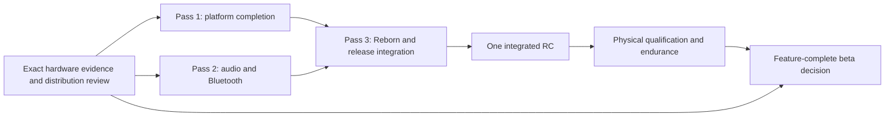

# Y2Linux + Reborn Community Beta 1 — feature-completion plan

## CPU idle candidate01 hardware result — 2026-10-03

Owner-installed Linux3dfb5f5/Rebornb71b4688 is now tested on unchanged boot
`e0eb2f36-7c1f-4007-99e2-81d2eae047d4`, taint0. C1 and C2 are WORKING; C2
adds7,040 entries/49.674049s in60.047965s (82.72%), restores/media errors0.
Natural parking, three hotplug cycles, all five OPPs before/after preflight,
screen/workload wake, real playback and USB/independent Wi-Fi integrity pass.
**Overall CPU idle qualification FAILS:** C3 preflight retains UART1/SPI0,
PERI0x02020000, and no physical dormant call occurs. Other reported static
prerequisites pass. C3 remains off; dynamic deadline/context/CIRQ wake unobserved.

Exact MT6582 source follow-up corrects SPI idle polarity/UART DMA metadata,
retains unknown/live/aliased engines and adds read-only handoff operands.
Candidate02 requires a fresh preserving build and owner flash; no claim that it
already releases both clocks. Electrical battery benefit and full-system suspend
remain unqualified. No flash/push, protected-data write, external issue closure
or unrelated release promotion. See [physical result](../validation/Y2-CPU-IDLE-COMPLETION-PHYSICAL.md)
and [source follow-up](../validation/Y2-CPU-IDLE-COMPLETION.md).

## CPU idle software handoff — 2026-10-03

One fresh preserving CPU idle candidate is sealed and software validated at
Linux3dfb5f5/Rebornb71b4688. Kernel/config/DT/modules/ABI, Buildroot/Reborn ARM,
production364 cases with native prerequisites completed, Reborn238 cases,
QEMU/ELF/dependencies and package validation pass. C1/C2 are physically WORKING
on the verified installed baseline; C2 shows useful84% residency and a
controlled enabled/disabled comparison. C3 is SOFTWARE_READY_NEEDS_NEW_FLASH,
with no actual dormant entry claimed. Candidate hardware acceptance remains
NOT_RUN; the single automated SSH qualification follows owner-only flash.
No flash/push, Y2DATA or protected-partition write, milestone closure or
unrelated release-gate promotion. Exact hashes, source ledger, changes and owner
command: [completion record](../validation/Y2-CPU-IDLE-COMPLETION.md).

CPU idle update,2026-10-03: installed baseline C1 and C2 are now physically
working (C2+7182 entries/+50.763741s of60.404076s, restores/storage errors0).
C3 source and one coherent candidate target the owner-flash boundary; no actual
dormant success is claimed. This supersedes historical C2 wording below, while
full suspend and unrelated release gates remain open. See
[CPU idle completion](../validation/Y2-CPU-IDLE-COMPLETION.md) and
[physical evidence](../validation/Y2-CPU-IDLE-COMPLETION-PHYSICAL.md).

## Sealed feature-completion integration — 2026-10-02

**READY FOR HARDWARE DECISION RUN**. The [implementation pass](Y2-COMMUNITY-BETA-IMPLEMENTATION-PASS.md) records the ten-workstream results, fresh build/tests, exact hashes and single owner handoff.233features and their release requirements remain. Native wired24/high-rate programming and full-resume closure remain unresolved; physical qualification and public distribution are separate open gates. No flash or push. Older snapshots below are historical.

## Active implementation campaign — 2026-10-02

The owner now explicitly authorizes implementation, fresh validation and one
owner-local BOOTIMG/Y2ROOT integration candidate, preserving Y2DATA. The original
planning-only authorization statement below describes the earlier document, not
the current session. No flash/push or public release is authorized.

Use [the implementation pass](Y2-COMMUNITY-BETA-IMPLEMENTATION-PASS.md) for current
results and the unchanged233-feature JSON for remaining obligations. Latest live
identity is candidate4, taint0; the earlier unflashed statement is superseded by
read-only observation. Ten independent lanes are being completed together.
Native wired24/high-rate fetch/clock evidence, same-boot full resume, actual C2/C3,
robust storage/USB and codec peer/distribution acceptance remain hard gates;
working fallbacks do not waive them. Current verdict remains **FEATURE COMPLETION
IN PROGRESS** pending fresh integrated validation and owner physical decisions.

<!-- knowledge-base-scope: proposed-release-plan -->

Updated **2026-10-02** following the owner's explicit release-target correction. This replaces the earlier minimum-subset planning philosophy. Authority is **documentation/planning only**: no implementation, build, flash, physical test, push, publication or milestone activation is performed or authorized by this document. The [master audit](Y2-COMMUNITY-BETA-FEATURE-AUDIT.md) and [233-feature JSON inventory](Y2-COMMUNITY-BETA-FEATURES.json) preserve factual state, failures, fallbacks and evidence.

## What feature-complete beta means

**All intended major product capabilities are present**, with polished end-user operation, even if some have bounded experimental labels, bugs or named peer/card compatibility limits. Community testing should find bugs, compatibility, UX and endurance issues across the intended product, rather than discover that its main capabilities were intentionally omitted.

Required vision: high-quality wired playback and meaningful native24-bit where the AFE path supports it; native88.2/96 where supported; viable Classic SBC/XQ/AAC/aptX/HD/LDAC and ABR; intelligent CPU power management including C2 and evaluated C3; actual deep sleep and same-boot Power/RTC wake; admitted598/747.5/1040/1196/1300MHz; fastest robust eMMC/SD modes; reliable high-performance USB; useful battery/charging; polished Reborn; safe preserving update/recovery.

A feature may remain out only for a demonstrated hardware limit, legal/distribution restriction, or genuinely nonessential experiment outside the intended major product. **Difficulty, missing qualification, reverse engineering, a lower-mode fallback or the seven-day deadline are not exclusion reasons.** Safety remains a gate: no corruption, unsafe power behavior, unexplained repeated reboot or unworkable recovery is accepted under an “experimental” label.

## Exact current baseline and verdict

Reclassification source: Linux `e2dd583` (full hash in the audit/JSON), Reborn `b92d312cc2dc4b74f57a1a9a7b1407e34707137a`. Newest sealed candidate4 was built from Linux `dcbd7d1` / code `3920a54`; its [receipt](../validation/Y2-SD-SDR104-DIAG.md#candidate-4-receipt) reports304 production/platform tests and ARM/ELF/inventory/legal-info checks PASS. **Candidate4 is unflashed and physically unqualified.** Candidate3 remains latest reported installed/physically characterized; Fix02 remains latest broad physical qualification. No new hardware observation was made in this reclassification.

Candidate3 reported200MHz SD CRC failures across sampling/drive sweeps, with SDR104 timing capped100MHz passing2GiB at~42MB/s. Candidate4 adds stock input-pad and card-driver controls; its pending hardware result matters. Neither prior failure proves200MHz impossible after the remaining correct settings, nor the short100MHz pass proves production integrity.

**Verdict: FEATURE COMPLETION IN PROGRESS.** Native wider/higher-rate hardware output is not implemented; Classic optional endpoints remain disabled; C2 correction lacks closure; C3 has no entry proof; full suspend returns from SPM but fails before completed userspace resume. Existing lower paths work, but do not complete the target. Distribution and first-owner installation also remain unresolved.

## Independent planning axes

Every feature retains implementation state and evidence independently from:

| Product target | Release meaning |
| --- | --- |
|CORE_RELEASE_FEATURE|Required functional/safety/integration foundation|
|FEATURE_COMPLETE_TARGET|Intended product capability; difficult or disabled does not mean optional|
|CONDITIONAL_ON_HARDWARE|Required hardware investigation, then implementation/qualification if supported|
|ACCEPTABLE_BETA_LIMITATION|Explicit permitted limitation, with required safe alternative where applicable|
|UNSUPPORTED_HARDWARE|No supported target hardware/platform path; scope the evidence precisely|
|EXPERIMENTAL_POST_BETA|Genuinely nonessential extension outside the specified major product|

`release_required`, `hardware_conditional`, `public_distribution_state`, `current_limitation`, `next_action` and A–G completion groups are explicit in JSON. Meaningful24-bit is FEATURE_COMPLETE_TARGET with a hardware condition;88.2/96 and C3 are CONDITIONAL_ON_HARDWARE. Codec distribution approval is independent of technical viability. **91 former C/D rows move into required/conditional scope; all233 rows receive the new axes.** Counts and exact changed IDs are in JSON. No maturity promotion is implied; only F233 gains SOFTWARE_VALIDATED from the new sealed receipt.

## Three engineering passes

These are coherent work batches with reviewed interfaces, **not20 separate candidate releases**. Source work and targeted software checks can overlap; hardware access is serialized and requires its separate owner boundary. One shared-device reality and available engineering time limit parallelism. Hardware evidence needed to implement safely cannot be postponed until after all code is written.

### Pass 1 — Platform feature completion

**Goal:** complete power/sleep/storage/USB/battery platform behavior, maintaining existing electrical and data safeguards.

- Close C2 actual entry/residency/restore; evaluate C3 preflight/topology/≤747.5MHz entry, runtime PCM, CIRQ, GPT4 deadline and CPU context. Preserve full active OPP range with bin/thermal guards.
- Localize the existing full-resume stall using Fix03 breadcrumbs; complete same-boot Power and RTC wake plus storage/USB/radio/display/audio restoration. Define platform sleep intent/status and active-playback/charging policy for Reborn.
- Finish current SD ceiling investigation and qualify HS200/DDR52/HS52 plus SD SDR104/SDR50/DDR50/HS. Select the fastest robust supported mode per board/card; retain automatic containment and known lower fallbacks. Do not arbitrarily cap all users to50MHz.
- Close existing loaded USB DMA failure with progress-aware guard/focused repair; verify PIO fallback, throughput, repeated integrity, reconnect and supported host sleep/wake.
- Complete useful SOC/charging/warnings/shutdown/reserve. Investigate actual MT6323/Y2 current/coulomb/NTC support; implement only a proven calibrated measurement path. Root/data integrity and thermal safety are non-negotiable.

**Exit:** platform source complete for supported scope; unresolved hardware questions have exact evidence or remain explicit blockers. Existing bounded1196/1300MHz qualification is retained; mixed workload/endurance/comfort is the gap, not admission optionality. C2+parking equivalence to C3 requires measured drain/latency and an explicit owner product decision, not assumed equivalence.

### Pass 2 — Audio / Bluetooth feature completion

**Goal:** native high-quality output and the full viable Classic codec product.

- Resolve exact MT6582 fetch/packing/interconnect/rate-clock evidence before adding ALSA masks. Implement meaningful24-bit via the proven S24/S32/24-in32 path; implement88.2/96 if supported. Keep decode precision, DSP precision, ALSA format, AFE fetch, I2S slots, payload and DAC precision distinct.
- Preserve native44.1/48; integrate real sink capability negotiation/conversion, truthful source/output information and robust format/rate transitions. Wider containers are not proof of preserved bits.
- Complete SBC XQ, AAC, aptX, aptX HD, LDAC quality/ABR integration. Existing encoders/BlueALSA/private builds are a foundation, not required new codec implementations.
- Complete peer capabilities, mutual availability, user preferences, qualified Auto, actual negotiated reporting, bounded fallback/reconnect and CPU/load/thermal behavior. Measure Wi-Fi coexistence at admitted quality modes.
- Resolve public distribution review independently. Do not fake approval flags or interpret a disabled endpoint as permission to bundle its binary. Retain FEATURE_COMPLETE_TARGET if lawfully public inclusion remains blocked.

**Exit:** supported wired modes and codec behaviors integrated with software proof; exact physical cases prepared, compatible peers available and distribution decisions recorded. Missing peer/capture equipment is an acceptance/resource blocker, not a hardware-unsupported verdict. Linkage alone does not close audible or ABR behavior.

### Pass 3 — Reborn / release polish

**Goal:** expose completed features as a coherent product, with understandable installation, use and recovery.

- Integrate the deliberate Power sleep/wake flow, active-playback screen-off distinction, audio format/codec/quality/Auto controls and truthful status through the platform API. Expose existing EQ cleanly; no DSP architecture rewrite.
- Finish current Productv2 navigation, one-detent/one-step with intentional acceleration, focus/Back/long-name/empty/error behavior, boot handoff and final shutdown frame. Any engineering-prototype route becomes pre-release work. Existing generic-Unavailable pruning is retained, not redone.
- Keep technical diagnostics separate; provide a redacted bug bundle with clear export/retrieval, distinct from private state backup. No scattered Y2-specific access; inspect any new boundary exceptions.
- Complete first-owner provisioning, supported identity/layout checks, personal keys and firmware delivery, protected partition exclusions, license/source/package checks and tester instructions.
- Qualify safe preserving beta1→beta2 update and recovery. Fully automatic OTA can remain an explicit limitation if the manual preserving workflow is rehearsed; do not require an A/B architecture project.

**Exit:** no dead engineering routes in supported workflows; release candidate interfaces/code/package scope fixed; named exceptions are hardware/distribution/nonessential only. No publishing or flashing is authorized by this plan.

### Candidate and dependency strategy

Reuse existing candidate4 and retained hardware evidence for targeted investigation where separately authorized. Do not create one public candidate per CPU/codec/UI subsystem. A bounded diagnostic iteration is justified if needed for safe hardware proof; count and identify it, and never call it an integrated RC.

After three passes, seal **one integrated RC** with exact Linux/Reborn sources, kernel/root/codec/firmware identities and enabled-feature manifest. Run broad RC software/image/source/notices checks once. Then perform integrated physical qualification and endurance. A reproduced safety/core blocker may require one focused RC correction with affected regression; a mandatory new correction means the original one-week date may slip.

P1 and P2 can overlap source investigation and independent components, but audio/codec power and sleep restoration depend on the finalized platform behavior. P3 UI preparation can overlap; final integration waits for actual typed contracts. Distribution/provisioning/documentation starts Day1, not Day7.

## Aggressive one-week roadmap

Seven days is an **attempt at maximum realistic completion**, not an evidence-backed promise. It assumes prompt hardware/peer access and enough implementation capacity for overlapping work; one engineer plus one device cannot execute every lane simultaneously. Exact AFE hardware evidence and the unknown resume stall are the largest schedule uncertainties. Do not shorten necessary safety observations to meet the date.

| Day | Batched work and overlap | Required decision / dependency |
| --- | --- | --- |
|1|Freeze real target; reconcile candidate4 ceiling evidence when available; investigate C3/suspend/AFE fields/current-sense path; begin firmware/codec distribution and onboarding work; prepare Reborn integration contracts|Name exact missing registers/stock programming, capture access, compatible peers and firmware delivery. Hardware impossibility needs proof; unknown stays open|
|2|Pass1: localize/fix full-resume stall, C2/C3 prerequisites, storage pads/tuning, DMA/reconnect and power gaps. Parallel audio evidence and release tooling preparation|Successful same-boot diagnostic return or exact outstanding stall; storage ceiling direction; no removal of safety predicates to obtain entry|
|3|Pass2 wired: implement proven native24-bit and88.2/96 path, conversion/negotiation and low-bit software fixtures. Complete remaining platform interfaces|If exact DL1/interconnect/clock proof remains absent, record unresolved fields and likely delay. S16 fallback does not close this feature|
|4|Pass2 BT: endpoint/policy/quality/ABR integration; peer and coexistence bring-up, CPU measurement where authorized; P1 regression; P3 typed UI integration|Each codec separately records built/enabled/mutual/negotiated/audible/load/distribution status. A missing peer or legal decision remains a named gate|
|5|Pass3: Power/audio/codec controls, wheel/boot/shutdown, diagnostic export, install/update/recovery; finish targeted software gates and seal one integrated RC if required implementation/hardware decisions are resolved|Feature freeze, exact delivered capability manifest and supported limits. Do not seal an allegedly feature-complete RC over known mandatory omissions|
|6|Integrated physical qualification: mode/bit/clock/peer checks, Power/RTC wake/restoration, fast storage and USB hashes, charge/load and full tester journey; start overnight endurance|Stop on corruption, unsafe thermal/power, repeated reboot or core playback failure. Correct defects only; affected results reset|
|7|Finish endurance/cycles, preserving-update/recovery rehearsal, second-person instructions, source/notices/private-state checks; final release decision|Publish only same tested bytes if gates close. Otherwise issue a precise remaining-blocker schedule and delay; never silently move main features post-beta|

Preparatory targeted hardware evidence during passes must have separate authorization; this documentation task runs none. Day6–7 can accommodate an8h wired window and shorter codec/sleep windows only if most implementation and peer bring-up are already complete. Charging reserve/hold and low-power evidence can need additional elapsed time. If the feature freeze slips, the integrated/endurance window moves with it.

## Exact delay triggers and missing proof

| Required feature | Current blocker / missing proof | Decision if not closed within one week |
| --- | --- | --- |
|Meaningful native24-bit|Exact MT6582 DL1 fetch/packing/interconnect, bit capture and DAC acceptance|Delay unconditional feature-complete release while unknown. Exclude only after demonstrated hardware limit, recorded honestly|
|88.2/96|Exact rate/clock programming and measured native clocks/sample count|Same hardware-proof decision; decoded high-rate files are not completion|
|C2/C3|C2 post-fix entry; C3 topology/domains/clocks/CIRQ/GPT4/context/actual return|Close C2; C3 remains conditional pending real evidence or explicit measured equivalent-product tradeoff. Time shortage alone cannot defer it|
|Full deep sleep|Post-resume console/platform/thaw/notifier stall; no complete Power/RTC same-boot product return|Delay beta. Screen-off/Power Off are fallbacks, not full sleep|
|Classic codecs/ABR|Endpoints off, no optional peer/audible/CPU/coexistence proof, unresolved public rights|Delay technical completion; legal-only omission may be separately documented/accepted, with target retained|
|Storage ceiling|Candidate4 untested, no sustained high-mode write/sleep proof|Qualify highest robust lower mode after proper ceiling investigation; do not insist200MHz if genuine board/card limit is demonstrated|
|DMA USB|Fix03 source repair not physically closed; prior0/10 loaded uploads|Complete/qualify DMA or prove concrete hardware/driver limit and accepted bounded PIO product behavior; no silent performance scope cut|
|Battery measurement|Unproven sense/coulomb/NTC topology/calibration|Resolve support; useful labeled SOC/charging may satisfy approved hardware limitation, but warnings/shutdown/charging safety cannot be omitted|
|Distribution/install|Firmware permission/delivery, codec review, personal keys, current first-install workflow|Block public release until lawful deliverable and understandable recovery exist; private experimentation is not public clearance|

## Top 10 implementation tasks

These are proposed work, not changes made by this audit. “Implement” includes completing/admitting existing guarded code; do not rewrite what is already present.

1. **Repair full resume completion:** use Fix03 stage journal to identify the failed return-to-userspace call, then close Power/RTC same-boot wake.
2. **Complete intelligent idle:** close C2, evaluate/admit C3's runtime PCM/CIRQ/GPT4/context path without weakening predicates; retain full guarded OPP range.
3. **Stabilize fastest storage modes:** finish candidate4 pad/card-driver/tuning work and robust production ceiling selection, with fallbacks and integrity.
4. **Close USB/power gaps:** resolve residual DMA/reconnect issues, charging/shutdown state restoration, safe low-voltage reserve and truthful conditional measurements.
5. **Implement native meaningful24-bit output:** exact proven AFE fetch/interconnect/ALSA/I2S contract, low-bit preservation and sink reporting.
6. **Implement native88.2/96 where supported:** exact clock/rate programming and stable format/rate transitions.
7. **Complete Classic codec product paths:** SBC XQ/AAC/aptX/HD/LDAC endpoints, quality/ABR, peer intersection, preference/Auto and actual reporting.
8. **Integrate Reborn product behavior:** deliberate sleep/playback policy, codec/audio/EQ controls, wheel/boot/shutdown/empty states and clean typed boundary.
9. **Finish tester operations:** redacted diagnostics, transfer help, first-owner keys/data/firmware, preserving update and recovery workflow.
10. **Complete release composition:** rights decisions, exact source/notices, capability manifest, protected exclusions, credential/private-state rejection and reproducible packaging.

## Top 10 physical qualification tasks

No test below is run or authorized by this documentation update. Preserve existing bounded passes and repeat affected/integrated paths, not unchanged ROM provenance.

1. **Power and RTC full sleep/wake:** staged gates then actual same-boot return, wake reason, every restored subsystem, no watchdog reset; at least10 mixed cycles and longer sleep residence. Numeric drain claims require measurement.
2. **C2/C3 and admitted CPU OPPs:** real entries/residency, deadline/IRQ/context checks, park/restore, mixed workload and charging comfort at1196/1300 under existing guards; no forced overheating.
3. **Native audio precision/rates:** low-bit fixtures and I2S capture, native44.1/48/88.2/96 where admitted, format/rate switching, channel/sign/packing/pop and audible fidelity.
4. **Every viable Classic codec:** actual peer negotiation and audible output, SBC XQ and LDAC modes, user/Auto/fallback/reconnect; ABR adaptation observed, not inferred from linkage.
5. **Coexistence and codec load:** Wi-Fi off/idle/scan/transfer with each admitted codec quality, CPU/thermal/underrun data, screen-off and sleep-restoration behavior; publish named peer limits.
6. **Fast storage integrity:** selected eMMC/SD highest-robust modes plus fallbacks, multi-offset reads/writes/fsync/hashes, representative cards/filesystems, hotplug/replacement, runtime PM/sleep and boots; zero data corruption.
7. **USB integrity/performance/recovery:** DMA then PIO fallback,10×1MiB each direction before a mixed≥256MiB corpus,10 cable sessions, supported host sleep/wake; hashes and sustained throughput recorded, no terminal fault.
8. **Battery/charging/shutdown:** ordinary PC/wall sources, load/idle/hold/recharge, honest SOC, warning/reserve, app/DB persistence, actual off and clean next boot; measured current/temp only when real.
9. **Polished full tester journey:** current wheel/button/Power semantics, every normal route, boot/shutdown video, realistic1k–10k library/formats, diagnostic retrieval, initial install and preserving beta2/recovery rehearsal.
10. **Integrated endurance:**8h mixed wired/high-resolution playlist,at least20min audible operation per admitted codec family,30min per admitted LDAC quality mode and a2h highest-load/ABR segment (overlap compatible segments),≥2h actual sleep/residence/wake campaign; combine bounded scans/transfers where safe. Extend beyond the week for unexplained growth/dropout/heat or inadequate codec coverage; collectors alone are not tests.

Retain exact images/source/boot IDs, negotiated modes, before/after counters, audible observations and bounded resource trends. A failed codec/mode cannot be marked qualified because another passed. Limited compatibility and community endurance discovery are acceptable only after the minimum safe functioning product is shown. Physical regression of an unchanged foundation can ride on integrated tests; no isolated233-test hardware campaign is required.

## Release/distribution and permitted limitations

The pinned [codec ledger](../../tools/platform/codec-sources.json) records unresolved FDK rights review, freeaptx source/product review and LDAC NOTICE/certification review. This is evidence of unestablished public approval, not a new definitive legal judgment. Track AAC/aptX/HD/LDAC as FEATURE_COMPLETE_TARGET plus DISTRIBUTION_BLOCKED_OR_REVIEW_REQUIRED. Endpoint disablement does not remove bundled binaries. Firmware likewise needs established permission or a tested lawful owner-local path; calibration stays device-local. Do not remove technical targets simply to make legal packaging easier.

Manual preserving update is acceptable after a real rehearsal and clear recovery. Estimated SOC is acceptable if useful and visibly honest while conditional measurement questions are resolved. Named peer/card/revision limits and lower fallbacks remain. Fully automatic BOOTIMG/A-B OTA, extra Favorites/search/playlist screens, NCM if ECM suffices, network/video/FM product expansion and advanced DAC features outside the proven path are genuinely nonessential to this defined release.

Do not create fake work for LE Audio without ISO support, Adaptive/Lossless without a supported implementation path, SD HS400, unsupported host VBUS power or imagined DAC functions. Lack of proof for native24/96, C3, battery current or host wiring is **conditional**, not proof of absence.

## Required beta documentation and final decision

Prepare supported-device/host/card/peer matrix; actual feature manifest and known bugs; first install/backup/personalization; controls and distinct sleep/screen-off/off behavior; source-versus-output precision and codec/quality/Auto; transfer; battery/charging; preserving updates/recovery; diagnostic export/privacy; exact hashes/source/notices and any hardware/distribution exclusions. Begin drafts during implementation; finalize against actual tested behavior. This planning task does not write those end-user manuals.

At release, answer separately: are major features implemented, are hardware conditions resolved, are safety/physical gates passed, is composition publicly deliverable, and is ordinary use polished? If any required major capability remains simply unfinished, verdict is FEATURE COMPLETION IN PROGRESS and beta moves. READY FOR INTEGRATED RC requires implementation closure and explicit hardware/distribution decisions; READY FOR FEATURE-COMPLETE BETA additionally requires integrated physical/endurance/recovery acceptance.

## Release-completion groups — every open item

These replace the earlier A–E meaning and may overlap. Every one of233 rows carries an explicit assignment in the [master matrix](Y2-COMMUNITY-BETA-FEATURE-AUDIT.md#3-complete-feature-matrix) and JSON `release_completion_index`; the full ID index is at the end of the audit. Existing mature foundations are marked for carry-forward regression, not falsely reopened as unimplemented.

| Group | Meaning | Principal work |
| --- | --- | --- |
|A|MUST IMPLEMENT BEFORE FEATURE-COMPLETE BETA|Resume/product sleep, conditional nativeHD, codec enablement/integration, EQ/product polish, current gaps in provisioning/export|
|B|MUST PHYSICALLY QUALIFY BEFORE FEATURE-COMPLETE BETA|Supported complete product, including high modes/codecs/sleep; retained bounded passes carried forward|
|C|REQUIRED IF HARDWARE SUPPORTS IT|Native24-bit/rates, C3, SDR104 ceiling, real battery measurements and host board path; exact questions/proof in audit/JSON|
|D|RELEASE / DISTRIBUTION BLOCKER|Firmware/codecs, source/notices, keys, compatibility, installation, safe update/recovery and exact public package|
|E|ACCEPTABLE BETA LIMITATION|Manual update, truthful bounded measurement/compatibility/logging limits; never a catch-all for unfinished major features|
|F|GENUINELY POST-BETA / EXPERIMENTAL|Nonessential extras and engineering interfaces outside specified product vision|
|G|UNSUPPORTED / DO NOT PURSUE|Unsupported current controller/codec paths; SD HS400 is explicitly invalid in the F050 subfeature record|

**Release verdict: FEATURE COMPLETION IN PROGRESS.** This is the intended full-product plan, with a seven-day attempt and explicit delay criteria. Safe fallback behavior is retained throughout; it does not erase feature obligations.
