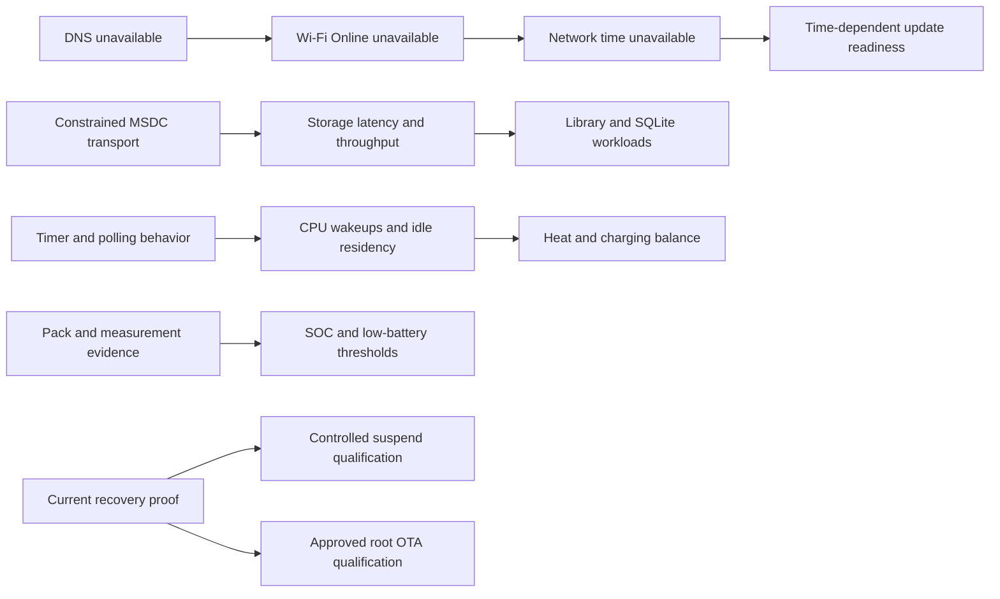

# Platform v1 physical master issues

Campaign started 2026-09-26. Evidence and target identity:
[bring-up report](PLATFORM-V1-PHYSICAL-BRINGUP.md). Confidence describes the
root cause, not the certainty of an observed symptom. Allowed confidence values:
CONFIRMED, STRONGLY_SUPPORTED, SUSPECTED, UNKNOWN. Pending rows are not passes.

| ID | Subsystem | Symptom | Root cause | Severity | Confidence | Evidence | Fix | Commit | Rebuilt? | Physically retested? | Final status |
| --- | --- | --- | --- | --- | --- | --- | --- | --- | --- | --- | --- |
| PHY-001 | Wi-Fi/time | WPA2/DHCP/ping work; ordinary DNS fails; NTP unavailable | Driver advertises NETIF_F_HW_CSUM while adapter checksum flags stay zero and no path calls the firmware offload setter; partial TCP/UDP checksums are not completed | Major | STRONGLY_SUPPORTED | `10-network-probes`, `13-dns-offload-diagnostic`: alternating identical DNS query fails twice normally, succeeds twice with socket-local SO_NO_CHECK; source gl_init.c/nic_tx.c/wlan_oid.c | Remove unsupported offload advertisement; kernel candidate and real TCP/DNS/NTP regression required | `2f82a28` | Yes: Physical 01 | Diagnostic isolation only | IMPLEMENTED / PHYSICAL RETEST PENDING |
| PHY-002 | Storage | eMMC/SD constrained to legacy one-bit 13 MHz | Conservative DT and CMD6 policy; exact stock Y2 board data specifies eight/four data pins | Major | CONFIRMED | Current ios, `14-emmc-direct`, retained stock msdc platform data and width disassembly | Width-only 8/4 at unchanged 13 MHz/legacy/3.3 V; EXT_CSD comparison/fallback and candidate qualification | `2f82a28` | Yes: Physical 01 | No | IMPLEMENTED / PHYSICAL RETEST PENDING |
| PHY-003 | CPU/power | Dummy local timers; deeper idle unqualified | Local clockevent/nohz limitations; deeper SPM dependencies not established | Major | STRONGLY_SUPPORTED | Current kernel log, prior timer census and WFI source | Measure residency/wakeups; evidence-backed timer review | — | No | No | OPEN |
| PHY-004 | Telemetry | Capability platform_version remains candidate.1 on candidate.2 | Static capability metadata not bound to running release | Minor | CONFIRMED | `00-identity`, `03-capabilities` | Bind capability identity to installed release at image generation and observation | `2f82a28` | Yes: Physical 01 | No | IMPLEMENTED / PHYSICAL RETEST PENDING |
| PHY-005 | Power | No measured pack current, temperature or SOC; shutdown thresholds disabled | Hardware/calibration/load-curve evidence missing | Major | UNKNOWN | Capabilities and power supplies | Inspect exact PMIC/vendor/pack evidence; external measurement | — | No | No | OPEN / EVIDENCE GATE |
| PHY-006 | Suspend | Prior same-boot deep wake failed; source mask repair unqualified | Earlier CPU3 ACK mismatch confirmed; residual path unknown | Major | UNKNOWN | GPU-01 physical receipt and corrected source | Prerequisite recovery then staged controlled test | — | No | No | OPEN |
| PHY-007 | Benchmark/kernel | Storage benchmark stops after first write with EINVAL | CONFIG_ADVISE_SYSCALLS disabled; ARM ksys_fadvise64_64 stub returns EINVAL; unconditional benchmark advice lacks unavailable handling | Major | CONFIRMED | `11-emmc-benchmark`; exact candidate kernel.config | Add advisory syscall capability plus explicit benchmark handling; direct-I/O census continues separately | `2f82a28` | Yes: Physical 01 | No | IMPLEMENTED / PHYSICAL RETEST PENDING |
| PHY-008 | SD identity | Inserted FAT32 card rejected as no_unique_supported_filesystem | blkid reports FAT32/partition but omits filesystem UUID; platform requires UUID | Major | CONFIRMED | `07-raw-baseline`, `08-services-interfaces` | Dedicated SD lifecycle batch: safe CID/partition fallback identity; no reformat or serial rewrite | — | No | No | OPEN / NEXT SD BATCH |
| PHY-009 | Memory telemetry | Reborn/service PSS unavailable | CONFIG_PROC_PAGE_MONITOR disabled; smaps and smaps_rollup absent | Moderate | CONFIRMED | `07-raw-baseline` and exact candidate kernel.config | Enable measured process-memory observation in coherent kernel config | `2f82a28` | Yes: Physical 01 | No | IMPLEMENTED / PHYSICAL RETEST PENDING |
| PHY-010 | SD integrity | Unclean flag and inconsistent FAT metadata | Existing primary/backup dirty flag and volume-label differences; original cause unknown | Safety gate | UNKNOWN | Read-only `15-sd-and-jack-check`; no lost-chain/crosslink error reported, no repair made | Pause device workloads; owner removal of unmounted suspect medium, then separately approve/qualify card repair or clean replacement | — | No | No | ISOLATED / CARD REMAINS GATED |
| PHY-011 | Wired telemetry | Headphone Jack remains off with owner-confirmed connected plug | DT omits codec IRQ; upstream reports jack events from its IRQ handler | Moderate | CONFIRMED | `16-resume-preflight`, DAC DT comment and cs43130 IRQ handler | Keep jack state explicitly unavailable until exact EINT16 routing and initial-state handling are qualified; audio tests continue | `2f82a28` | Yes: Physical 01 | No | IMPLEMENTED / PHYSICAL RETEST PENDING |
| PHY-012 | Library performance | 20k list page p50 93.6 ms; WAL commits stall >3 seconds | Missing ordered browse index and optional-filter OR predicates cause scan/sort; transport bottleneck independently measured | Major | CONFIRMED | `17`, `18`, `29`, `41`, `43`: exact-query result hashes unchanged; page ~95→5 ms, indexed artist ~5 ms, album ~1.5 ms | Measured indexes/direct predicates, compatible schema; scanner/WAL regression after transport fix | `5c3f87c` | Yes: Physical 01 | Diagnostic A/B only | IMPLEMENTED / PHYSICAL RETEST PENDING |
| PHY-013 | Bluetooth/Reborn | Pair & Connect ends after Pair; no PCM and reconnect remains inhibited | Pair completion sets Trusted only, omits explicit Connect and final connect intent | Major | CONFIRMED | Reborn bluetooth.rs completion handler; `30`–`38` no PCM, operation pair and Inhibited | Verify bond, then explicit Connect under the existing operation lease; no second automatic reconnect owner | `5c3f87c` | Yes: Physical 01 | No | IMPLEMENTED / PHYSICAL RETEST PENDING |
| PHY-014 | Bluetooth bonding | AirPods briefly connect/pair but no retained bond; later authentication rejected | Adapter Pairable times out; Reborn Pair does not enable it; Linux hci_io_capa_request_evt forces No Bonding when HCI_BONDABLE is clear | Major | STRONGLY_SUPPORTED | `31`, `32`, `34` trace No Bonding and Pairing Not Allowed; exact Linux 6.18 path; temporary window `40`/`45` | Bound Pairable to the explicit pairing operation, restore policy, require Bonded before success; physical trace/retest pending | `5c3f87c` | Yes: Physical 01 | Diagnostic pending | IMPLEMENTED / PHYSICAL RETEST PENDING |
| PHY-015 | Bluetooth UI | Connected link hides Pair & Connect despite no bond; audio selection enabled without PCM | Presentation treats Connected as Paired and uses labels as state | Major | CONFIRMED | `49`, `50`; main.rs projection and UI context actions | Typed paired/bonded/connected/audio state; pair remains available, output requires PCM; stale-menu regression passes | `feb530f` | Yes: Physical 01 | No; owner deferred headphones | IMPLEMENTED / PHYSICAL RETEST PENDING |
| PHY-016 | Release/radio | Early and root userspace carry different signed regulatory database versions | Early pin stayed at 2026.05.30 when locked Buildroot moved to the 2026.09.03 package | Moderate | CONFIRMED | Pinned source package hash/makefile and completed rootfs versus tools/build/regulatory.py | Match the reviewed Buildroot archive and enforce byte equality in artifact/package checks | `dd5e802` | Yes: Physical 01 | No | IMAGE VALIDATED / PHYSICAL RETEST PENDING |
| PHY-017 | Release validation | Retained valid base package refused by checksum inventory | Validator excludes nested evidence SHA256SUMS files as though they were the top-level self-inventory | Moderate | CONFIRMED | Base hashes all match; only 33 nested checksum receipts differ from the computed inventory | Exclude only the top-level file; nested receipt acceptance/tampering/omission regression; original base remains unchanged | `198fa7c` | Host tooling only | Not a device change | FIXED / HOST VALIDATED |

## Initial dependency graph

Edges identify investigation dependencies or possible shared effects; they do
not assert an unmeasured causal explanation. More independent subsystem rows
will be added as the broad census exposes their actual state.
