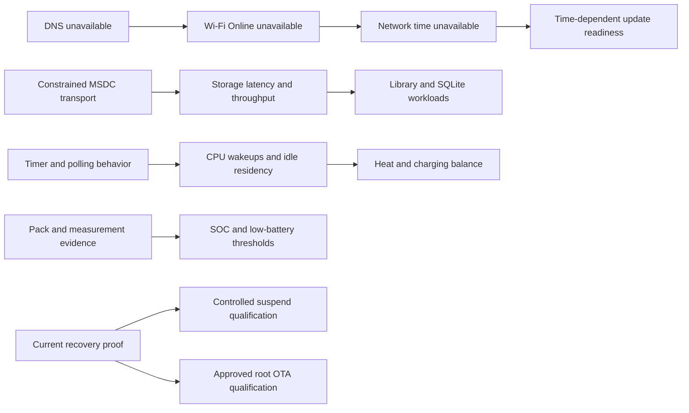

# Platform v1 physical master issues

Campaign started 2026-09-26. Evidence and target identity:
[bring-up report](PLATFORM-V1-PHYSICAL-BRINGUP.md). Confidence describes the
root cause, not the certainty of an observed symptom. Allowed confidence values:
CONFIRMED, STRONGLY_SUPPORTED, SUSPECTED, UNKNOWN. Pending rows are not passes.

| ID | Subsystem | Symptom | Root cause | Severity | Confidence | Evidence | Fix | Commit | Rebuilt? | Physically retested? | Final status |
| --- | --- | --- | --- | --- | --- | --- | --- | --- | --- | --- | --- |
| PHY-001 | Wi-Fi/time | WPA2/DHCP/ping work; ordinary DNS fails; NTP unavailable | Driver advertises NETIF_F_HW_CSUM while adapter checksum flags stay zero and no path calls the firmware offload setter; partial TCP/UDP checksums are not completed | Major | STRONGLY_SUPPORTED | `10-network-probes`, `13-dns-offload-diagnostic`: alternating identical DNS query fails twice normally, succeeds twice with socket-local SO_NO_CHECK; source gl_init.c/nic_tx.c/wlan_oid.c | Remove unsupported offload advertisement; kernel candidate and real TCP/DNS/NTP regression required | `2f82a28` | Yes: Physical 01 | Yes: normal checked DNS, NTP and three bidirectional TCP repeats (`02`/`13`) | FIXED / BASELINE PHYSICAL PASS; reconnect/endurance open |
| PHY-002 | Storage | eMMC/SD constrained to legacy one-bit 13 MHz | Conservative DT and CMD6 policy; exact stock Y2 board data specifies eight/four data pins | Major | CONFIRMED | Current ios, `14-emmc-direct`, retained stock msdc platform data and width disassembly | Width-only 8/4 at unchanged 13 MHz/legacy/3.3 V; EXT_CSD comparison/fallback and candidate qualification | `2f82a28` | Yes: Physical 01 | Yes: IOS 8/4, verified eMMC direct I/O, three SD passes and full fsync/metadata (`03`/`10`/`15`) | FIXED / WIDTH BASELINE; higher timing pending |
| PHY-003 | CPU/power | Dummy local timers; deeper idle unqualified | Local clockevent/nohz limitations; deeper SPM dependencies not established | Major | STRONGLY_SUPPORTED | Current kernel log, prior timer census and WFI source | Measure residency/wakeups; evidence-backed timer review | — | No | No | OPEN |
| PHY-004 | Telemetry | Capability platform_version remains candidate.1 on candidate.2 | Static capability metadata not bound to running release | Minor | CONFIRMED | `00-identity`, `03-capabilities` | Bind capability identity to installed release at image generation and observation | `2f82a28` | Yes: Physical 01 | Yes: candidate.3 identity and capabilities agree (`00`/`01`) | FIXED / PHYSICAL PASS |
| PHY-005 | Power | No measured pack current, temperature or SOC; shutdown thresholds disabled | Hardware/calibration/load-curve evidence missing | Major | UNKNOWN | Capabilities and power supplies | Inspect exact PMIC/vendor/pack evidence; external measurement | — | No | No | OPEN / EVIDENCE GATE |
| PHY-006 | Suspend | Prior same-boot deep wake failed; source mask repair unqualified | Earlier CPU3 ACK mismatch confirmed; residual path unknown | Major | UNKNOWN | GPU-01 physical receipt and corrected source | Prerequisite recovery then staged controlled test | — | No | No | OPEN |
| PHY-007 | Benchmark/kernel | Storage benchmark stops after first write with EINVAL | CONFIG_ADVISE_SYSCALLS disabled; ARM ksys_fadvise64_64 stub returns EINVAL; unconditional benchmark advice lacks unavailable handling | Major | CONFIRMED | `11-emmc-benchmark`; exact candidate kernel.config | Add advisory syscall capability plus explicit benchmark handling; direct-I/O census continues separately | `2f82a28` | Yes: Physical 01 | Yes: complete eMMC and SD benchmark; advice accepted, all readback/fsync/metadata pass (`15`) | FIXED / PHYSICAL PASS |
| PHY-008 | SD identity | Inserted FAT32 card rejected as no_unique_supported_filesystem | blkid reports FAT32/partition but omits filesystem UUID; platform requires UUID | Major | CONFIRMED | `07-raw-baseline`, `08-services-interfaces` | Dedicated SD lifecycle batch: safe CID/partition fallback identity; no reformat or serial rewrite | — | No | No | OPEN / NEXT SD BATCH |
| PHY-009 | Memory telemetry | Reborn/service PSS unavailable | CONFIG_PROC_PAGE_MONITOR disabled; smaps and smaps_rollup absent | Moderate | CONFIRMED | `07-raw-baseline` and exact candidate kernel.config | Enable measured process-memory observation in coherent kernel config | `2f82a28` | Yes: Physical 01 | Yes: Reborn smaps_rollup/PSS readable (`01`/`04`) | FIXED / PHYSICAL PASS |
| PHY-010 | SD integrity | Unclean flag and inconsistent FAT metadata | Existing primary/backup dirty flag and volume-label differences; original cause unknown | Safety gate | UNKNOWN | Read-only `15-sd-and-jack-check`; no lost-chain/crosslink error reported, no repair made | Pause device workloads; owner removal of unmounted suspect medium, then separately approve/qualify card repair or clean replacement | — | No | No | ISOLATED / CARD REMAINS GATED |
| PHY-011 | Wired telemetry | Headphone Jack remains off with owner-confirmed connected plug | DT omits codec IRQ; upstream reports jack events from its IRQ handler | Moderate | CONFIRMED | `16-resume-preflight`, DAC DT comment and cs43130 IRQ handler | Keep jack state explicitly unavailable until exact EINT16 routing and initial-state handling are qualified; audio tests continue | `2f82a28` | Yes: Physical 01 | Yes: telemetry honestly unavailable; wired audio owner-confirmed (`01`/`09`) | FIXED TELEMETRY / JACK IRQ STILL OPEN |
| PHY-012 | Library performance | 20k list page p50 93.6 ms; WAL commits stall >3 seconds | Missing ordered browse index and optional-filter OR predicates cause scan/sort; transport bottleneck independently measured | Major | CONFIRMED | `17`, `18`, `29`, `41`, `43`: exact-query result hashes unchanged; page ~95→5 ms, indexed artist ~5 ms, album ~1.5 ms | Measured indexes/direct predicates, compatible schema; scanner/WAL regression after transport fix | `5c3f87c` | Yes: Physical 01 | Yes: 1k/10k/20k counts and quick checks; page p50 ~2.08 ms, 20k commit p99 ~550 ms (`05`) | FIXED BROWSE BASELINE / matched attribution and envelope pending |
| PHY-013 | Bluetooth/Reborn | Pair & Connect ends after Pair; no PCM and reconnect remains inhibited | Pair completion sets Trusted only, omits explicit Connect and final connect intent | Major | CONFIRMED | Reborn bluetooth.rs completion handler; `30`–`38` no PCM, operation pair and Inhibited | Verify bond, then explicit Connect under the existing operation lease; no second automatic reconnect owner | `5c3f87c` | Yes: Physical 01 | Partial: owner connects, actual SBC PCM and clean audio (`04`/`07`); fresh Pair flow/reconnect pending | PARTIAL PHYSICAL PASS |
| PHY-014 | Bluetooth bonding | AirPods briefly connect/pair but no retained bond; later authentication rejected | Adapter Pairable times out; Reborn Pair does not enable it; Linux hci_io_capa_request_evt forces No Bonding when HCI_BONDABLE is clear | Major | STRONGLY_SUPPORTED | `31`, `32`, `34` trace No Bonding and Pairing Not Allowed; exact Linux 6.18 path; temporary window `40`/`45` | Bound Pairable to the explicit pairing operation, restore policy, require Bonded before success; physical trace/retest pending | `5c3f87c` | Yes: Physical 01 | Partial: retained Paired/Bonded/Trusted and successful SBC (`04`/`07`); fresh pairing trace pending | PARTIAL PHYSICAL PASS |
| PHY-015 | Bluetooth UI | Connected link hides Pair & Connect despite no bond; audio selection enabled without PCM | Presentation treats Connected as Paired and uses labels as state | Major | CONFIRMED | `49`, `50`; main.rs projection and UI context actions | Typed paired/bonded/connected/audio state; pair remains available, output requires PCM; stale-menu regression passes | `feb530f` | Yes: Physical 01 | Partial: menu visible, connected bonded peer and audio PCM; edge-state UI retest pending | PARTIAL PHYSICAL PASS |
| PHY-016 | Release/radio | Early and root userspace carry different signed regulatory database versions | Early pin stayed at 2026.05.30 when locked Buildroot moved to the 2026.09.03 package | Moderate | CONFIRMED | Pinned source package hash/makefile and completed rootfs versus tools/build/regulatory.py | Match the reviewed Buildroot archive and enforce byte equality in artifact/package checks | `dd5e802` | Yes: Physical 01 | Yes: firmware/radio startup, WPA2/DNS/TCP work; broader regulatory modes not claimed | IMAGE VALIDATED / BASELINE RADIO PASS |
| PHY-017 | Release validation | Retained valid base package refused by checksum inventory | Validator excludes nested evidence SHA256SUMS files as though they were the top-level self-inventory | Moderate | CONFIRMED | Base hashes all match; only 33 nested checksum receipts differ from the computed inventory | Exclude only the top-level file; nested receipt acceptance/tampering/omission regression; original base remains unchanged | `198fa7c` | Host tooling only | Not a device change | FIXED / HOST VALIDATED |

## Hardware ceiling follow-up observations

Current private receipt prefix is
`out/platform-v1-hardware-ceiling/20260926T184237Z-physical01/`.
Owner confirms the SD128 ext4 card is a different known-good card; PHY-010's
original suspect FAT medium remains isolated. PHY-008 is not resolved by a
replacement card with a valid UUID. Historical evidence above remains retained.

| ID | Observation / confidence | Current action and acceptance boundary |
| --- | --- | --- |
| PHY-018 | Direct-fixture SBC is clean but control fails. Fixed Reborn playback is clean and owner confirms working play/pause; retained trace captures no incoming AVRCP command. Owner and trace evidence are distinct. | Direct fixture is not the registered product player; no current product control failure established. Fresh pair/reconnect/endurance/coexistence remain open. #31 |
| PHY-019 | ECM receive path repeatedly achieves ~40 Mb/s with 592–611 host sender retransmissions per measured run; transmit ~47 Mb/s with zero sender retransmissions. Symptom CONFIRMED; cause UNKNOWN. | Separate TCP/SFTP/crypto/storage; reconcile exact stock integrated DMA and retained PIO fallback. Host-listener timeout retained; device-listener direction succeeds. #27/#32 |
| PHY-020 | Reborn reports transient supplicant_unavailable/connection churn despite an associated working network, later Online. Root cause SUSPECTED control-command timeout. | Time control queries and inspect readiness transitions before changing timeouts or claiming radio disconnects. #31 |

Reborn sink repair (PHY-021, CONFIRMED): `rb_sink_open` omitted the returned
PCM device name, so the real player rejected its correctly opened sink contract.
ALSA null-PCM regression failed before the repair; seven audio tests and the
fixed ARM app pass. Receipt `29`: 182.955 s actual SBC, zero XRUN/recovery/decode/
playback errors; original app/session restored (`37`). Include in Hardware Batch
2; direct fixture success alone did not catch this product failure. #29/#31

Timer cause (PHY-003, CONFIRMED for the local-clockevent gap): exact stock starts
GPT6 as the CP15 physical counter; upstream GPT initialized only GPT1/2. Counter
was stopped on all cores. Bounded `34` test calibrates 12 samples near 13 MHz
and delivers 12 PPI29 one-shots, restores controls and unloads. Clean reboot
`39`–`41` returns taint 0. Integrated tickless/high-resolution/deeper idle still
unqualified; source/host-build work is grouped into Hardware Batch 2. #28/#34

Suspend follow-up (PHY-006, residual causes UNKNOWN): recovered receipt `49`
supersedes the incomplete SSH stream `43`. Freezer/devices/platform/processors
all return on boot `b3d92d70`, taint 0; CPU3/2/1 shut down and return. USB
terminates after devices with -EOVERFLOW (`IRQ=477827 events=05`), and WMT/radio
restart times out (-110) after processors. The old helper masks radio restore
failure, so rc=0 is not an acceptance result. Core and SPM entry have no receipt.
The owner-confirmed fresh Power Menu reboot recovers pinned SSH on `fffb5ac5`,
unchanged Physical 01, taint 0, pm_test none, all CPUs online, clean filesystem
counters and health OK. Hardware 02 adds USB overflow diagnostics and propagates
radio restore failures. Root causes and a successful complete resume remain
open; one detached, persistently logged stage plus host recovery verification
is required before advancing. #16/#28/#34

Core hotplug receipt `16` successfully steps 4→3→2→1→2→3→4 online cores,
with five-second idle and checked SHA-256 load windows at each count. CPU3/2/1
power-off and restart all succeed; final SPM broken=0, four cores online,
same boot, taint 0 and ext4 counters 0. This supersedes the old CPU3 mask
failure for manual hotplug only; it does not qualify full suspend, audio under
hotplug, automatic policy, power savings or endurance (PHY-003/PHY-006).

## Initial dependency graph

Edges identify investigation dependencies or possible shared effects; they do
not assert an unmeasured causal explanation. More independent subsystem rows
will be added as the broad census exposes their actual state.
